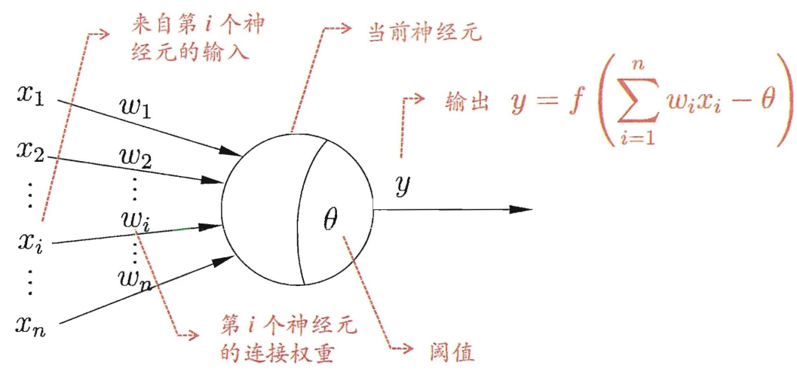
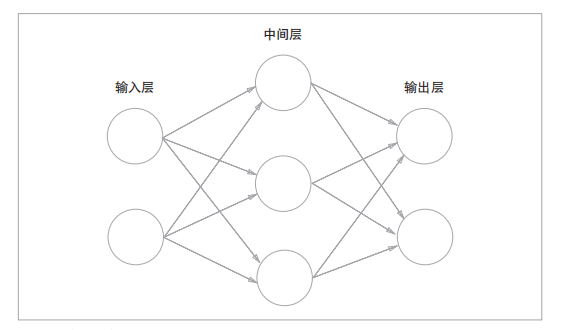
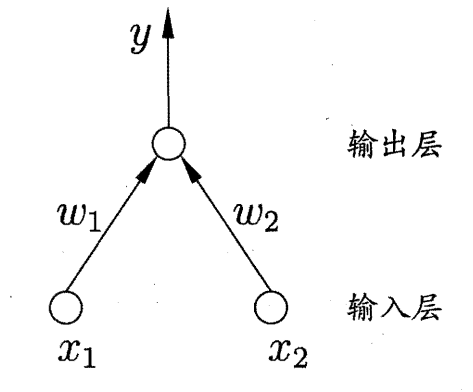
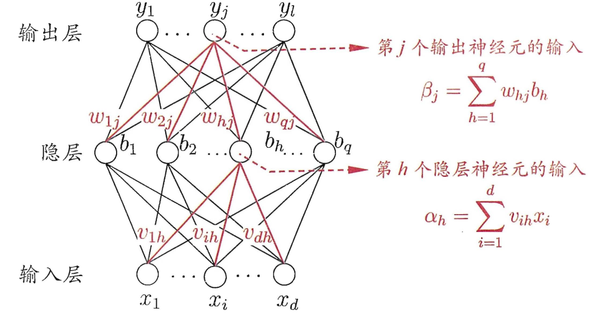
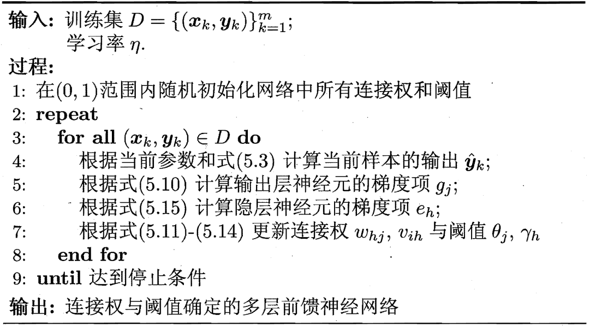
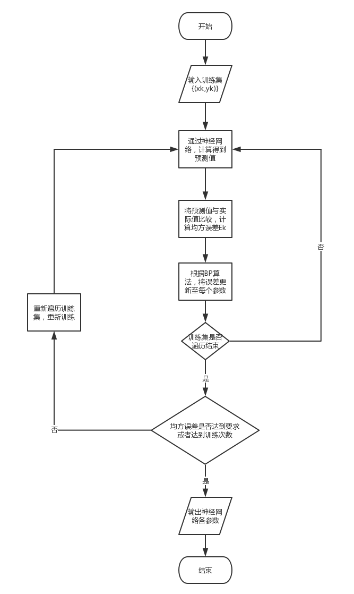
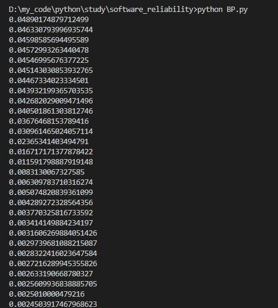
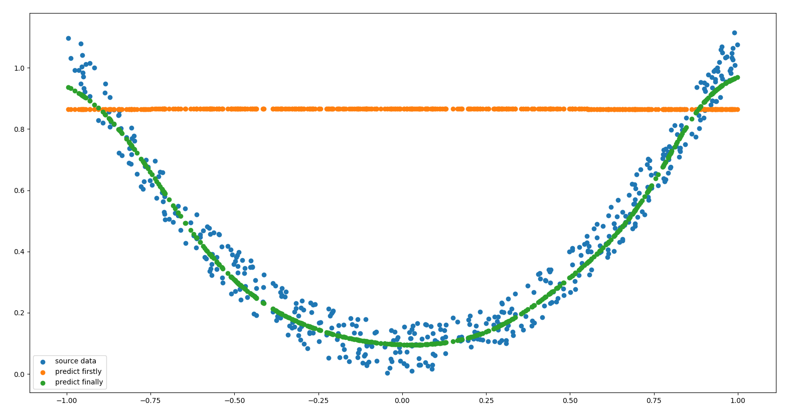
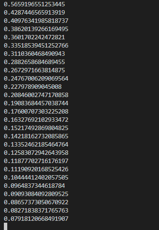
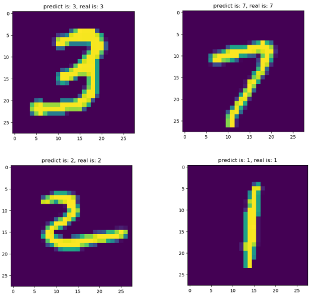

# BP神经网络

[TOC]

## 0. 简介

BP神经网络模型，是1986年由Rumelhart和McClelland为首的科学家提出的概念，是一种按照误差逆向传播算法训练的多层前馈神经网络，是目前应用最广泛的神经网络。

**注：如果github上无法显示公式，请参考：[https://blog.csdn.net/u014568072/article/details/88872404](https://blog.csdn.net/u014568072/article/details/88872404)。或者参考我的博客：[https://www.jianshu.com/p/9d8453f2a44c](https://www.jianshu.com/p/9d8453f2a44c)**。

## 1. 神经网络基本模型

### 1.1. 单神经元模型



其中，`f(x)`函数为神经元输出经过的**激活函数**。

常见的激活函数有：

- sigmoid函数

$$sigmoid(x) = \frac{ 1 }{ 1+exp(-x) }$$

- sgn函数(阶跃函数)

$$ sgn(x)=\begin{cases}
1, & x\geq0 \\
0, & x<0 \\
\end{cases}$$

- ReLU(Rectified Linear Unit)函数

$$ relu(x)=\begin{cases}
x, & x>0 \\
0, & x\leq0 \\
\end{cases}$$

- ......

值得注意的是，激活函数大多为**非线性函数**。原因在于：

> 线性函数的问题在于，不管如何加深层数，总是存在与之等效的“无隐藏层的神经网络”。为了具体地（稍微直观地）理解这一点，我们来思考下面这个简单的例子。这里我们考虑把线性函数 h(x) = cx 作为激活函数，把y(x) = h(h(h(x)))的运算对应3层神经网络A。这个运算会进行y(x) = c × c × c × x的乘法运算，但是同样的处理可以由y(x) = ax（注意，a = c^3）这一次乘法运算（即没有隐藏层的神经网络）来表示。

### 1.2. 多层神经网络



当神经网络有多层时，中间的层称为中间层或隐藏层。隐藏层的输入为上一层的输出，隐藏层的输出为下一层的输入，对隐藏层的输出同样需使用**激活函数**。输入层则一般不需要经过激活函数。

值得注意的是，一个神经元的输出会传递到下一层的**每个**神经元上。

### 1.3. 神经网络学习过程

以感知机(由两层神经元组成)为例:



对于训练样例$(X, y)$，其中$X=\{x_1, x_2\}$，当前神经网络的输出为$\hat{y}$。假定输出层的激活函数为阶跃函数，其数学推导为：

$$\hat{y} = f(w_1x_1 + w_2x_2 - \theta)$$

将实际值$y$与预测值$\hat{y}$进行数学比较，从而得出各权值$w_i$和阈值$\theta$的误差，从而更新相应的权值和阈值：

$$\Delta w_i = \eta(y - \hat{y})x_i$$

$$w_i \leftarrow w_i + \Delta w_i$$

其中，$\eta \in (0,1)$，称为学习率。当$\hat{y}$与$y$相等，或者之差足够小时，则可认定为训练成功。

## 2. BP误差反向传播算法

### 2.1. 算法推导

BP神经网络的数学推导过程相对简单，读者切不可望而却步。

更详细内容请参考西瓜书第5章——神经网络。

以三层神经网络为例：



**注**：输入层到隐藏层的阈值为$\gamma_h$，隐藏层到输出层的阈值为$\theta_j$，激活函数$f(x)$都为$Sigmoid$函数。

假定，对于一组样例$(X_k, Y_k)$，神经网络输入为$X_k = (x_1^k, x_2^k,..., x_d^k)$，输出为$\hat{Y}_k = (\hat{y}_1^k, \hat{y}_2^k,..., \hat{y}_l^k)$。

隐藏层输出为：

$$b_h = f(\alpha_h - \gamma_h)$$

输出层输出为：

$$\hat{y}_j^k = f(\beta_j - \theta_j)$$

那么，神经网络在**当前样例$(X_k, Y_k)$上**的**均方误差**为：

$$E_k = \frac{1}{2}\sum_{j=1}^l(\hat{y}_j^k-y_j^k)^2$$

根据均方误差结果，基于**梯度下降**策略，以目标的负梯度方向对隐层到输出层的权值参数$\Delta w_{hj}$进行调整。给定学习率，有：

$$\begin{aligned}
\Delta w_{hj} &= -\eta\frac{\partial E_k}{\partial w_{hj}} \\
\Delta w_{hj} &= -\eta\frac{\partial E_k}{\partial \hat{y}_j^k}\cdot\frac{\partial \hat{y}_j^k}{\partial \beta_j}\cdot\frac{\partial \beta_j}{\partial w_{hj}}
\end{aligned}$$

显然：

$$\frac{\partial E_k}{\partial \hat{y}_j^k} = \hat{y}_j^k-y_j^k$$

根据图例中$\beta_j$的函数，又显然：

$$\frac{\partial \beta_j}{\partial w_{hj}} = b_h$$

再根据$Sigmoid$函数的定义：

$$f^\prime(x) = f(x)(1-f(x))$$

则：

$$\frac{\partial \hat{y}_j^k}{\partial \beta_j} = \hat{y}_j^k(1-\hat{y}_j^k)$$

综上可得：

$$\Delta w_{hj} = -\eta(\hat{y}_j^k-y_j^k)\hat{y}_j^k(1-\hat{y}_j^k)b_h$$

令：

$$g_j = \hat{y}_j^k(y_j^k-\hat{y}_j^k)(1-\hat{y}_j^k)$$

最终：

$$\Delta w_{hj} = \eta g_j b_h$$

进而，我们可以对隐藏层到输出层的阈值$\theta_j$进行调整：

$$\begin{aligned}
\Delta \theta_j &= -\eta\frac{\partial E_k}{\partial \theta_j} \\
\Delta \theta_j &= -\eta\frac{\partial E_k}{\partial \hat{y}_j^k}\cdot\frac{\partial \hat{y}_j^k}{\partial \theta_j} \\
\Delta \theta_j &= -\eta g_j
\end{aligned}$$

同理，我们可以得到输入层到隐藏层的权值和阈值误差为：

$$\begin{aligned}
\Delta v_{ih} &= \eta e_h x_i \\
\Delta \gamma_j &= -\eta e_h
\end{aligned}$$

其中：

$$e_h = b_h(1-b_h)\sum_{j=1}^l w_{hj}g_j$$

### 2.2. 梯度下降的理解

何为[梯度？](https://baike.baidu.com/item/%E6%A2%AF%E5%BA%A6/13014729?fr=aladdin)

首先，它是一个向量。

其次，它的定义为：设可微函数$f(x,y,z)$，对于函数上的某一个点$P(x,y,z)$，$\{\frac{\partial f}{\partial x}, \frac{\partial f}{\partial y}, \frac{\partial f}{\partial z}\}$则是该函数在$P$点的梯度。

通俗来讲，函数某一点的梯度，就是该点的斜率，该点变化率最大的方向。而负梯度，则是该点能最快接近函数极小值的方向。

那么，何为[梯度下降](https://baike.baidu.com/item/%E6%A2%AF%E5%BA%A6%E4%B8%8B%E9%99%8D/4864937?fr=aladdin)呢？

梯度下降则是，沿当前点的负梯度方向变化：$x \leftarrow x - \gamma \nabla$，其中$\gamma$为步长。如果步长足够小，则可以保证每一次迭代都在减小，但可能导致收敛太慢；如果步长太大，则不能保证每一次迭代都减少，也不能保证收敛。

以函数$f(x) = x^2$为例：

其梯度函数为$\nabla = 2x$。

点$p(1,1)$处的梯度为$2$。

设步长为0.2，点$p$处进行梯度下降后，下一个点则为$(0.6, 0.64)$。

在BP神经网络中，采用梯度下降则是为了以最快速度调整参数，将误差降到极小(此处涉及到极小与最小的数学问题，有兴趣者可以看看西瓜书)。

### 2.3. 算法步骤



### 2.4. 算法流程



### 2.5. 算法实现

详细代码在[BP.py](https://github.com/99MyCql/DS_and_Algorithms/blob/master/deep_learning/BP.py)中。

编写一个三层神经网络的`BP`类，在构造函数中初始化神经网络：

```py
'''
三层神经网络模型，包含：输入层、隐层、输出层
'''
class BP:
    '''
    构造函数，初始化三层神网络的各参数

    Args:
        x_count: 输入层神经元个数
        mid_count: 隐层神经元个数
        y_count: 输出层神经元个数
        eta: 学习率
        train_count: 最大训练次数
        precision: 误差精度
    '''
    def __init__(self, x_count, mid_count, y_count, eta=0.3, train_count=100, precision=0.00001):
        self.x_count = x_count
        self.mid_count = mid_count
        self.y_count = y_count
        self.eta = eta
        self.train_count = train_count
        self.precision = precision

        # 输入层到隐层的权值
        self.V = []
        for i in range(0, x_count):
            temp = []
            for j in range(0, mid_count):
                temp.append(2*random.random() - 1)
            self.V.append(temp)

        # 输入层到隐层的阈值
        self.gamma = []
        for i in range(0, mid_count):
            self.gamma.append(2*random.random() - 1)

        # 隐层到输出层的权值
        self.W = []
        for i in range(0, mid_count):
            temp = []
            for j in range(0, y_count):
                temp.append(2*random.random() - 1)
            self.W.append(temp)

        # 隐层到输出层的阈值
        self.beta = []
        for i in range(0, y_count):
            self.beta.append(2*random.random() - 1)
```

其次，在`BP`类中，编写一个训练神经网络的类方法：

```py
    '''
    神经网络训练函数

    Args:
        X: 列表，输入数据
        Y: 列表，实际输出数据
    '''
    def train(self, X, Y):
        if len(X) != len(Y):
            print("Error: len(X) and len(Y) is unequal!!!")
            return

        for i in range(self.train_count):
            E = [] # 每一组数据的误差
            # 遍历每一组输入数据
            for j in range(len(X)):
                # 计算预测值
                y_predict, mid_output = self.compute_y(X[j])

                # 计算当前样例(组)的均方误差
                e = 0.0
                mid2y_g = [] # 隐层到输出层的梯度项
                for k in range(self.y_count):
                    # 计算输出层第k个神经元的误差
                    e += pow(y_predict[k] - Y[j][k], 2)
                E.append(e/2)

                # 计算隐层到输出层的梯度项
                mid2y_g = []
                for k in range(self.y_count):
                    # 计算输出层第k个神经元对应的，隐层到输出层的梯度项
                    mid2y_g.append(y_predict[k] * (1 - y_predict[k]) * (Y[j][k] - y_predict[k]))

                # 计算输入层到隐层的梯度项
                x2mid_g = []
                for k in range(self.mid_count):
                    temp = 0
                    for l in range(self.y_count):
                        temp += self.W[k][l] * mid2y_g[l]
                    # 计算隐层第k个神经元对应的，输入层到隐层的梯度项
                    x2mid_g.append(mid_output[k] * (1 - mid_output[k]) * temp)

                # 更新隐层到输出层的权值和阈值
                for k in range(self.mid_count):
                    for l in range(self.y_count):
                        self.W[k][l] += self.eta * mid2y_g[l] * mid_output[k]
                for k in range(self.y_count):
                    self.beta[k] -= self.eta * mid2y_g[k]

                # 更新输入层到隐层的权值和阈值
                for k in range(self.x_count):
                    for l in range(self.mid_count):
                        self.V[k][l] += self.eta * x2mid_g[l] * X[j][k]
                for k in range(self.mid_count):
                    self.gamma[k] -= self.eta * x2mid_g[k]

            # 计算累积误差
            E_sum = 0.0
            for e in E:
                E_sum += e
            E_sum /= len(E)
            print(E_sum)

            # 如果累计误差小于设定的误差精度，则停止训练
            if E_sum < self.precision:
                break
```

该函数用到的类方法如下：

```py
    '''
    Sigmoid激活函数

    Args:
        x

    Returns:
        y: sigmoid(x)
    '''
    def sigmoid(self, x):
        return 1 / (1 + math.exp(-x))

    '''
    计算一组预测值

    Args:
        x: 列表，一组多元或一元的输入数据

    Returns:
        y: 列表，一组多元或一元的输出数据
        mid_output: 列表，隐层的输出数据
    '''
    def compute_y(self, x):
        # 计算隐层输入
        mid_input = []
        for i in range(self.mid_count):
            temp = 0
            for j in range(self.x_count):
                temp += self.V[j][i] * x[j]
            mid_input.append(temp)

        # 计算隐层输出
        mid_output = []
        for i in range(self.mid_count):
            mid_output.append(self.sigmoid(mid_input[i] - self.gamma[i]))

        # 计算输出层的输入
        y_input = []
        for i in range(self.y_count):
            temp = 0
            for j in range(self.mid_count):
                temp += self.W[j][i] * mid_output[j]
            y_input.append(temp)

        # 计算输出层的输出
        y = []
        for i in range(self.y_count):
            y.append(self.sigmoid(y_input[i] - self.beta[i]))

        return (y, mid_output)
```

最后，在`BP`类中，编写一个基于神经网络进行预测的类方法：

```py
    '''
    神经网络预测函数

    Args:
        X: 列表，输入数据

    Returns:
        Y_predict: 列表，预测输出数据
    '''
    def predict(self, X):
        Y_predict = []
        for x in X:
            y_predict, _ = self.compute_y(x)
            Y_predict.append(y_predict)
        return Y_predict
```

### 2.6. 算法检验

#### 2.6.1. 预测$y=x^2$模型

```py
'''
预测 y=x^2 函数模型
'''
# 数据个数
data_count = 500

# 随机生成X数据
X = []
for i in range(data_count):
    X.append([2*random.random() - 1])

# 根据一元二次方程生成Y数据
Y = []
for i in range(data_count):
    noise = random.random() / 6 # 生成噪音，使数据更真实
    Y.append([pow(X[i][0], 2) + noise])

plt.scatter(X, Y, label='source data') # 原始数据

# 创建神经网络
bp = BP(x_count=1, mid_count=10, y_count=1, eta=0.3, train_count=1000, precision=0.00001)

# 未训练进行预测
Y_predict = bp.predict(X) # 预测
plt.scatter(X, Y_predict, label='predict firstly') # 显示预测数据

# 训练
bp.train(X, Y)

# 训练之后进行预测
Y_predict = bp.predict(X) # 预测
plt.scatter(X, Y_predict, label='predict finally') # 显示预测数据

plt.legend()
plt.show()
```

控制台输出每一轮训练后的累计误差如下：



显示的原数据与预测数据对比图如下：



#### 2.6.2. 预测mnist手写数字图片数据集

```py
'''
预测mnist数字图片数据集
'''
# 获取数据
mnist = input_data.read_data_sets("MNIST_data/", one_hot=True)
# print(mnist.train.images.shape, mnist.train.labels.shape) # 训练集
# print(mnist.test.images.shape, mnist.test.labels.shape) # 测试集
# print(mnist.validation.images.shape, mnist.validation.labels.shape) # 验证集

# 取验证集中的一部分为训练数据，一部分为测试数据
X_train = mnist.validation.images[:100].tolist() # 将ndarray对象转换成列表
Y_train = mnist.validation.labels[:100].tolist()
X_test = mnist.validation.images[100:120].tolist()
Y_test = mnist.validation.labels[100:120].tolist()

# 创建神经网络，并用训练数据进行训练
bp = BP(x_count=784, mid_count=10, y_count=10, eta=0.3, train_count=100, precision=0.001)
bp.train(X_train, Y_train)

# 训练结束后，用测试数据进行预测
Y_predict = bp.predict(X_test)

# 显示预测结果
for i in range(len(Y_predict)):
    # 求一组预测输出数据中值最大的神经元位置
    max_pos = 0
    Max = 0
    for j in range(len(Y_predict[i])):
        if Y_predict[i][j] > Max:
            max_pos = j
            Max = Y_predict[i][j]

    image = X_test[i] # 获取测试集中对应的数据
    image = np.array(image).reshape(28, 28) # 将图像数据还原成28*28的分辨率，即28*28的数组
    plt.imshow(image)
    plt.title('predict is: {}, real is: {}'.format(max_pos, Y_test[i].index(1)))
    plt.ion()
    plt.pause(3)
    plt.close()
```

控制台输出每一轮训练后的累计误差如下：



挑选4张预测结果图片，如下：


